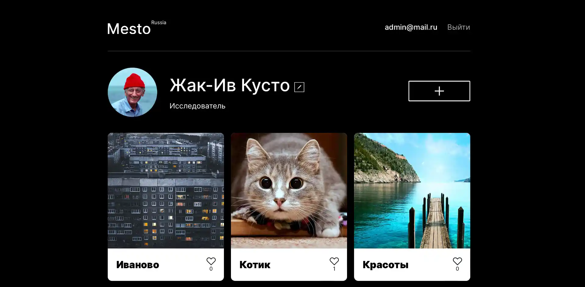

# Репозиторий проекта `Mesto`

### Описание
Репозиторий для проекта `Mesto`, включающий фронтенд и бэкенд части приложения со следующими возможностями: авторизации и регистрации пользователей, операции с карточками и пользователями. 

#### Демонстрация приложения: [https://mesto.pestov-web.ru/](https://mesto.pestov-web.ru/)
### Стек приложения

#### Дополнительно:
- Flexbox
- Grid-layout
- Адаптивная верстка
- Подход mobile-first
- ООП
- Работа с API
- Авторизация через http cookie
- ESLint airbnb
- CRUD
- Cors

### Бэкенд расположен в директории [backend/](https://github.com/pestov-web/react-mesto-api-full/tree/main/backend) , а фронтенд - в [frontend/](https://github.com/pestov-web/react-mesto-api-full/tree/main/frontend) .

